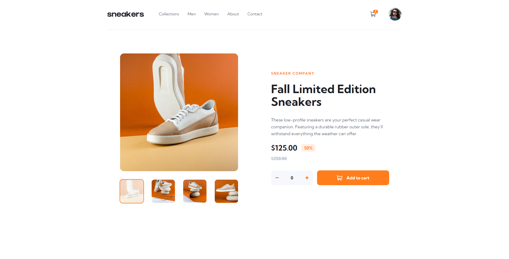

# E-commerce product page 

This is a solution to the [E-commerce product page challenge on Frontend Mentor](https://www.frontendmentor.io/challenges/ecommerce-product-page-UPsZ9MJp6).

## Table of contents

  - [The challenge](#the-challenge)
  - [Screenshot](#screenshot)
  - [Links](#links)
  - [Built with](#built-with)
  - [Author](#author)

### The challenge

Users should be able to:

- View the optimal layout for the site depending on their device's screen size
- See hover states for all interactive elements on the page
- Open a lightbox gallery by clicking on the large product image
- Switch the large product image by clicking on the small thumbnail images
- Add items to the cart
- View the cart and remove items from it

### Screenshot

### Links

- [Live Site](https://hromus-51.github.io/todo-app/)

### Built with

- [TS](https://www.typescriptlang.org/)
- [Styled Components](https://styled-components.com/)
- [React](https://reactjs.org/) 
- [Redux Toolkit](https://redux-toolkit.js.org/)
- [Redux Persist](https://www.npmjs.com/package/redux-persist)
- [Framer Motion](https://www.framer.com/motion/)

## Author

- Telegram - [Ilgiz Farrakhov](https://t.me/Gizmo51)